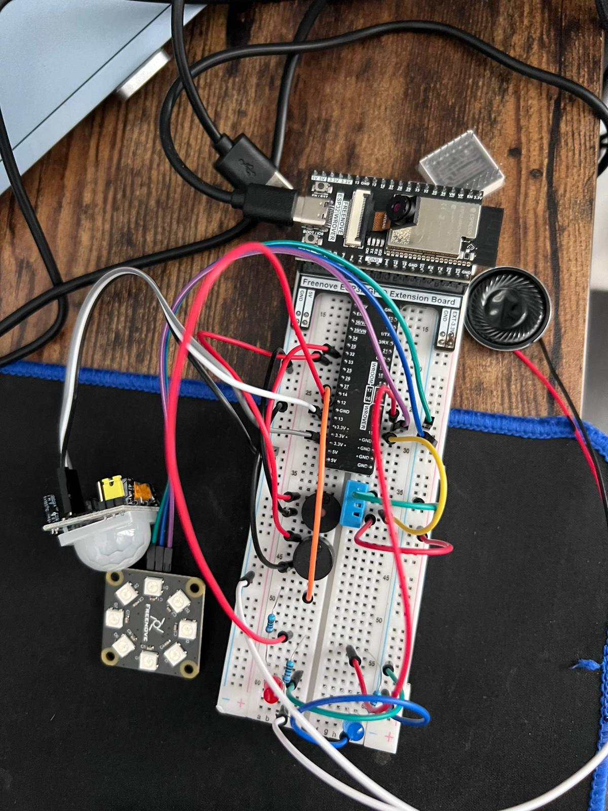

# Sistema de Casa Inteligente ESP32-WROVER


**Sistema de Casa Inteligente ESP32-WROVER com Detecção de Movimento e Áudio PWM**

Sistema completo de automação residencial baseado no ESP32-CAM AI Thinker, desenvolvido em MicroPython, integrando múltiplos sensores e atuadores para monitoramento e controle inteligente.

## Objetivo

Desenvolver um sistema IoT avançado de segurança e automação residencial que ofereça:

- Monitoramento visual contínuo através de câmera integrada
- Detecção automática de movimento com captura de evidências
- Controle de iluminação RGB programável  
- Sistema de alarme inteligente multi-nível
- Monitoramento ambiental de temperatura e umidade
- Notificações sonoras via sistema de áudio PWM
- Interface web responsiva para controle remoto total
- Armazenamento local de dados e imagens

O sistema visa proporcionar segurança, conforto e praticidade através de uma solução integrada e acessível.

## Features Principais

### Sistema de Câmera
- Streaming de vídeo ao vivo via interface web
- Captura de fotos em alta resolução sob demanda
- Configurações ajustáveis de qualidade, brilho, contraste e saturação
- Captura automática triggered por detecção de movimento
- Suporte a múltiplas resoluções (QVGA padrão)

### Detecção de Movimento
- Sensor PIR HC-SR501 com alcance de 3-7 metros
- Captura automática de fotos quando movimento detectado
- Sistema de armazenamento local com rotação automática (máximo 6 fotos)
- LED indicador para feedback visual do status
- Controle de armamento/desarmamento via interface web
- Período de warmup de 30 segundos e cooldown de 5 segundos

### Monitoramento Ambiental
- Sensor DHT11 para leitura de temperatura e umidade
- Cálculo automático de índice de conforto
- Alertas configuráveis baseados em zonas de conforto
- Atualizações em tempo real na interface web
- Histórico de dados ambientais

### Sistema de Iluminação RGB
- Fita LED NeoPixel com 8 LEDs individuais programáveis
- Controle de cores RGB completo (16 milhões de cores)
- Padrões de iluminação predefinidos (arco-íris, respiração, startup)
- Indicadores visuais de status do sistema
- Controle de brilho via interface web

### Sistema de Alarme Inteligente
- Três tipos de alarme: gentil, normal e urgente
- Integração com sensores ambientais para alertas automáticos
- Buzzer ativo e passivo para diferentes tipos de notificação
- Simulação de nascer do sol para despertar gradual
- Controle total via interface web

### Sistema de Áudio PWM
- Saída de áudio via PWM para alto-falante 8 ohms
- Múltiplos tipos de som: inicialização, movimento, foto, sucesso, erro, alarme
- Controle de volume de 0-100%
- Função mudo/som via interface web
- Melodias personalizáveis para diferentes eventos

### Interface Web 
- Design responsivo compatível com dispositivos móveis
- Controle completo de todos os sistemas
- APIs RESTful para integração com outros sistemas
- Atualizações automáticas de status a cada 5 segundos
- Galeria de fotos capturadas por movimento

### Armazenamento Local
- Fotos de movimento salvas na memória flash interna
- Sistema de rotação automática para gerenciar espaço
- Nomenclatura com timestamp para organização
- Acesso às fotos via interface web

## WiFi

### Modo Dual WiFi
O sistema opera em modo dual, oferecendo máxima flexibilidade de conectividade:

**Modo Station (Cliente WiFi)**
- Conecta-se automaticamente à rede WiFi existente
- SSID configurável: "MinhaWifiExemplo" 
- Senha configurável: "Senha123Exemplo"
- Timeout de conexão: 15 segundos
- Fallback automático para modo AP se conexão falhar

**Modo Access Point (Hotspot)**
- Cria rede WiFi própria quando necessário
- SSID: "ESP32-CAM"
- Senha: "12345678" 
- Subnet: 255.255.255.0
- Gateway: 192.168.4.1
- DNS: 8.8.8.8

### Funcionalidades de Rede
- Auto-reconexão em caso de perda de sinal
- Servidor web na porta 80
- Suporte a múltiplos clientes simultâneos
- Interface web otimizada para baixa latência

## Camera, Captura e Streaming

### Especificações da Câmera
- Módulo: OV2640 integrado ao ESP32-CAM
- Resolução máxima: 2MP (1600x1200 UXGA)
- Resolução padrão: QVGA (320x240) para streaming
- Formato: JPEG com compressão ajustável
- Taxa de quadros: ~20 FPS no streaming

### Configurações Ajustáveis
- **Qualidade JPEG**: 10 (melhor) a 63 (pior) - padrão 15
- **Brilho**: -2 a +2 - padrão 0
- **Contraste**: -2 a +2 - padrão 0  
- **Saturação**: -2 a +2 - padrão 0
- **Flip**: 0 (normal) ou 1 (invertido) - padrão 1
- **Mirror**: 0 (normal) ou 1 (espelhado) - padrão 1

### Modos de Operação
- **Streaming ao vivo**: Transmissão contínua via web
- **Captura manual**: Foto sob demanda via interface web
- **Captura automática**: Triggered por detecção de movimento
- **Qualidade adaptativa**: Menor qualidade para streaming, alta para fotos

### Sistema de Armazenamento
- Fotos salvas na memória flash interna
- Nomenclatura: motion_YYYYMMDD_HHMMSS.jpg
- Rotação automática: máximo 6 fotos mantidas
- Acesso via endpoint /api/photos

## Componentes

### Microcontrolador
- ESP32-CAM Wroom com PSRAM 8MB
- Antena WiFi 2.4GHz

### Sensores
- Sensor PIR HC-SR501 (detecção de movimento)
- Sensor DHT11 (temperatura e umidade)

### Sistema de Áudio
- Alto-falante 8 ohms 0.5W
- Buzzer ativo 5V (tom fixo)
- Buzzer passivo (frequências variáveis)

### Sistema de Iluminação
- Fita LED NeoPixel WS2812B (8 LEDs)
- LEDs indicadores 5mm (vermelho, azul, verde)

### Componentes Eletrônicos
- Resistores: 220Ω, 470Ω, 1kΩ, 10kΩ
- Capacitores: 100µF eletrolítico, 10µF cerâmico, 0.1µF cerâmico
- Protoboard 830 pontos
- Jumpers macho-macho e macho-fêmea

### Alimentação
- Fonte 5V 2A para alimentação principal
- Cabo USB para programação


## Configurações de Pinos

### Pinos da Câmera (ESP32-CAM)
```
D0: GPIO 4    D1: GPIO 5     D2: GPIO 18    D3: GPIO 19
D4: GPIO 36   D5: GPIO 39    D6: GPIO 34    D7: GPIO 35
HREF: GPIO 23    VSYNC: GPIO 25    SIOC: GPIO 27 (I2C Clock)
SIOD: GPIO 26 (I2C Data)    XCLK: GPIO 21    PCLK: GPIO 22
```

### Pinos dos Módulos Smart Home
```
RGB_STRIP: GPIO 2          # Fita LED NeoPixel (8 LEDs)
DHT11_SENSOR: GPIO 15      # Sensor temperatura/umidade
ACTIVE_BUZZER: GPIO 32     # Buzzer ativo 5V
PASSIVE_BUZZER: GPIO 33    # Buzzer passivo PWM
STATUS_LED: GPIO 0         # LED interno status (built-in)
PIR_SENSOR: GPIO 13        # Sensor PIR HC-SR501
MOTION_LED: GPIO 14        # LED indicador movimento
PWM_AUDIO: GPIO 12         # Saída PWM para alto-falante
AUDIO_STATUS_LED: GPIO 0   # LED status áudio (shared)
```


### Configurações de Hardware
```
XCLK_FREQ: 20MHz          # Clock externo da câmera
FB_LOCATION: PSRAM        # Frame buffer na PSRAM
NUM_LEDS: 8               # Quantidade de LEDs RGB
DEFAULT_BRIGHTNESS: 128   # Brilho padrão (0-255)
```

## Organização do Projeto @esp32wroom

### Estrutura de Diretórios
```
esp32wroom/
├── main.py                 # Arquivo principal do sistema
├── config.py              # Configurações centralizadas 
├── start.py               # Script de inicialização
├── deploy.py              # Script de deploy/upload
├── modules/               # Módulos do sistema
│   ├── environmental_sensor.py    # Sensor DHT11
│   ├── alarm_system.py           # Sistema de alarme
│   ├── rgb_strip.py              # Controle LED RGB
│   ├── motion_detector.py        # Detecção movimento + fotos
│   ├── pwm_audio.py              # Sistema áudio PWM
│   └── web_server.py             # Servidor web e APIs
└── lib/                   # Bibliotecas externas
    └── (bibliotecas MicroPython)
```

### Arquivo Principal (main.py)
- Inicialização dos módulos
- Loop principal do sistema
- Integração entre componentes
- Gerenciamento de erro e restart automático

### Configuração Central (config.py)
- Definição de todos os pinos GPIO
- Configurações WiFi e servidor web
- Parâmetros dos sensores e atuadores
- Validação de conflitos de pinos

### Módulos Individuais
**environmental_sensor.py**: Leitura DHT11, cálculo conforto, alertas
**alarm_system.py**: Três tipos de alarme, controle buzzers, simulação nascer do sol
**rgb_strip.py**: Controle NeoPixel, padrões, indicadores status
**motion_detector.py**: PIR sensor, captura fotos, armazenamento local
**pwm_audio.py**: Geração tons PWM, controle volume, múltiplos sons
**web_server.py**: Interface web, APIs REST, streaming câmera

### Scripts de Suporte
**start.py**: Script simplificado para inicialização rápida
**deploy.py**: Automação de upload de arquivos via ampy

### Bibliotecas (lib/)
- Bibliotecas MicroPython necessárias
- Drivers específicos para componentes
- Utilitários auxiliares

## Conclusão

O Sistema de Casa Inteligente ESP32-WROVER representa uma solução completa e integrada para automação residencial, combinando segurança, monitoramento e controle em uma única plataforma acessível.

### Principais Conquistas
- **Integração Total**: 8 sistemas diferentes trabalhando harmoniosamente
- **Interface Unificada**: Controle completo via web responsiva
- **Arquitetura Modular**: Fácil manutenção e expansão
- **Performance Otimizada**: Uso eficiente de recursos limitados
- **Documentação Completa**: Sistema bem documentado e testado

### Benefícios Alcançados
- **Segurança 24/7**: Monitoramento contínuo com detecção de movimento
- **Acesso Remoto**: Controle total via smartphone/tablet
- **Automação Inteligente**: Respostas automáticas a eventos
- **Custo Acessível**: Solução de baixo custo comparada a sistemas comerciais
- **Flexibilidade**: Configurações ajustáveis para diferentes necessidades

